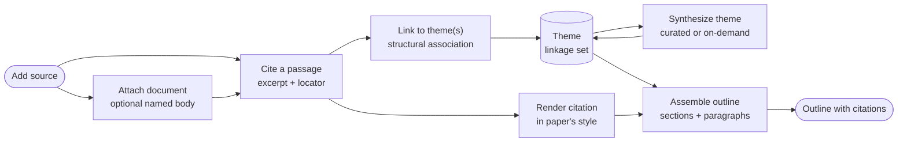

# Core Domain Distillation — Tiferet Literature Review Knowledge Base

**Status:** Draft · **Domain:** `lit-review` · **Code:** `app/` · **Branch:** `v1.x-proto`
**Companion:** `docs/domain-vision.md`

## 1. Purpose of this document

The vision statement says *what* this knowledge base is for. This document says
*how the domain is meant to work*: the vocabulary, the behaviors, the rules
those behaviors enforce, and the way the pieces relate. It is the reference a
contributor should read before writing the first domain object, and the
reference a reviewer should read before judging whether a change belongs.

**This distillation is still the conceptual reference**, even though capture,
theme synthesis, and APA rendering now exist on `v1.x-proto`. Where a claim
needs grounding, it is grounded in the Tiferet conventions this application is
built with — `DomainObject`, `DomainEvent`, `Aggregate`/`TransferObject`, and
`Service` — and, where already implemented, in `app/domain/`. Section 10 remains
the list of slices this vocabulary is meant to keep honest.

It is written to be legible to a technical-adjacent reader who has not yet read
the framework's own conventions in depth. Where a term is unavoidable, it is
defined once, in Section 3, and then used consistently.

## 2. The core domain, restated precisely

The core domain is **capturing sourced evidence and synthesizing it into
themes that can be assembled, correctly cited, into a paper's outline**.

A piece of reading does not become useful by being stored. An unattached
bibliographic stub is inert. An attached source document is still not a
citation — it is the work you can reopen, download under a stable name, or
compare — but meaning is made only once a specific passage is pulled out as
evidence and connected to an idea that recurs elsewhere in the literature.
That connection is where the intellectual work happens: not at the moment a
source is added, not at the moment a file is attached, and not at the moment
a passage is copied out, but at the moment a passage is told to belong to an
idea that other passages, from other works, also belong to.

The domain has exactly one shape:

> **Capture** a source → **attach** its document when the file is on hand →
> **cite** a passage from it → **link** the citation to a theme →
> **synthesize** the theme's description (curated or on demand) → **render**
> the citation in the paper's required style → **assemble** themes into the
> sections and paragraphs of an outline.

and exactly two axes of variation:

1. **Source medium** — the kind of work being read (PDF, book, journal
   article, and whatever is added later), which determines what bibliographic
   fields are expected and what a "locator" (the passage's precise position)
   means for that medium.
2. **Citation style** — the named formatting convention (APA, MLA, Chicago, or
   another) a given paper requires, which determines how a bibliographic
   record and a locator render into an in-text citation and a reference-list
   entry.

Everything else — attaching or retrieving a source's named document, recording
a citation's excerpt and locator, linking a citation to a theme,
re-synthesizing a theme's description as its linkages grow, and assembling
themes into an outline — is identical regardless of what kind of source is
being read or what style the paper eventually needs. How a locator maps into
an attached file, and which extension a download name carries, still follow
the source-medium axis. That asymmetry is the single most important fact
about this domain, and Section 8 treats it directly.

## 3. Ubiquitous language

**Source** — a work being read: a PDF, a book, or another medium added later.
Carries a bibliographic record and, when the researcher has the file, a named
source document. The document is optional; the bibliographic record is not.

**Source document** — the optional body of a source: the bytes of the work
itself, held with that source and no other. It has no identity of its own and
is not a `tiferet-kb` Document (that noun is reserved for an assembled
outline). It is created by attaching a file to an existing source, not as a
standalone record.

**Document name** — the API / download filename stored on the Source. When a
source document is retrieved, this is the name the file is written under — not
the original upload name on disk. If the caller does not supply one, the
Source derives a default from its bibliographic record
(`{first_author_slug}[_et_al]_{year}_{title_slug}.{ext}`), with `et_al` only
when there is more than one SourceAuthor. Deriving that name is Source
behavior, the same family as `authors_short`.

**Bibliographic record** — the structured metadata about a source (its
SourceAuthors, year, title, container title, publisher, and the other fields a
citation style needs) required to reference it correctly. Captured once, per
source, and reused by every citation and every rendering drawn from that source.

**SourceAuthor** — a value object copied onto a Source: the name as it appears
on that work, and only the name. It has no identity of its own, no publisher
id, and no life-cycle separate from the Source it belongs to. It is not created
on its own; `SourceAggregate.add_author` copies the printed name onto the
source. Persistence may rehydrate the same value object from stored display
names. Parsing a captured name into a family name and initials, and joining
those names for in-text or reference-list form, is behavior of SourceAuthor and
Source — not of a render event.

**Author** — a person who writes. This domain does not model Authors. Treating
a SourceAuthor as an Author (giving it an id, merging two names into one
person, or looking people up) is out of scope and would be a different bounded
context.

**Locator** — the precise position of a passage within a source: a page range
for a PDF or book today, and whatever position concept a future medium
requires (see Section 4).

**Citation** — an excerpt or paraphrase pulled from a source, together with its
locator and enough surrounding context to be understood on its own. The atomic
unit of evidence in this domain.

**Theme** — a strand of meaning that gathers citations from one or more
sources. A theme carries a **synthesized description**: a standing, current
statement of what its linked citations collectively say, distinct from any one
citation's wording.

**Linkage** — the structural relationship connecting a citation to a theme.
Forming a linkage is the atomic act of attaching evidence to an idea,
incrementing the theme's linkage count without destructively overwriting any
existing narrative description. A citation may hold linkages to more than one
theme.

**Synthesis** — the evaluative act of generating or revising a theme's
synthesized description against its full linkage set. Can be performed
manually by the researcher (curated editorial synthesis), invoked on demand
via an automated synthesis service (`theme synthesize`), or requested at link
time via an opt-in flag (`--include-synthesis`).

**Citation style** — a named formatting convention (e.g. APA, MLA, Chicago)
that determines how a bibliographic record and a locator are rendered.

**Formatted reference** — a bibliographic record rendered, in a given citation
style, into the reference-list entry form for a source.

**In-text citation** — a citation's locator rendered, in a given citation
style, into the short parenthetical or footnote form used inline in prose.

**Assembly** — the arrangement of one or more themes, with their supporting
citations rendered as formatted references and in-text citations, into the
sections and paragraphs of a paper's outline. Assembly does not draft prose; it
arranges already-synthesized, already-cited material.

**Outline** — the target structure (sections, and paragraph-level slots within
them) that an assembly populates.

**Provenance** — the unbroken path from any piece of content appearing in an
assembly back through its citation to its source, preserved regardless of how
many themes that citation has been linked to or how many outlines it has been
assembled into.

## 4. What the domain reads / operates on

The domain operates on bibliographic data about a source, on citation text
the researcher (or an agent) has already extracted, and — when attached — on
the named source document that belongs to that source. It does not parse the
file. That is a deliberate boundary (Section 9): PDF text extraction, OCR,
and the mechanics of getting words out of a book are infrastructure the
domain depends on, not part of it. Asking for "the body of this source" or
"the bytes at this locator" is domain; turning those bytes into words is
infrastructure.

What is captured, per source medium:

- **PDF or book (today):** SourceAuthors (names as printed), year, title, and
  publisher-family fields, plus a page-range locator for each citation drawn
  from it. The CLI may accept those names as strings; `AddSource` copies each
  one onto the source through `SourceAggregate.add_author`.
- **Any future medium** (journal article, web page, dataset, and so on) is
  expected to supply the same two things — a bibliographic record and a
  locator convention appropriate to that medium — without changing anything
  about how citations, linkages, or themes work. This is the leverage point of
  the source-medium axis: new mediums are new *field sets and locator shapes*,
  not new domain behavior.

At render time, the domain also takes a **citation style selection** as input,
and at assembly time it takes the **target outline shape** — the sections and
paragraph slots a specific paper defines. Neither input changes what a
citation or a theme *is*; both change how existing citations and themes are
*rendered and arranged*.

## 5. The behaviors

Each behavior below is a bounded step, described as a candidate domain event in
the Tiferet sense — a unit with a clear input and output, dependencies
supplied by injection, and an `execute(**kwargs)` entry point
(`tiferet/events/settings.py`). Capture, cite, link, synthesize, and render
already exist on `v1.x-proto`; attaching a source document does not. Naming
the missing step here is what makes Section 10 concrete.

### 5.1 Capturing a source

*Register a work being read, with its bibliographic record.*

Would be modeled as a domain event (candidate name: `AddSource`) constructing a
`Source` domain object and its mutable `Aggregate` counterpart, following
Tiferet's split between read-only domain objects and the aggregates that
mutate them (`tiferet/domain/settings.py`, `tiferet/mappers/settings.py`).
Author names are copied onto that aggregate one at a time; they are not
constructed as independent objects at the event boundary. `AddSource` does not
require a file; a source may be captured as bibliography only.

**Variable** with respect to the source-medium axis: the expected bibliographic
fields and the locator convention differ by medium. **Agnostic** otherwise: a
source is a source regardless of what will later be cited from it.

### 5.2 Attaching and retrieving a source document

*Hold the work with the source, under a stable download name, and give it
back on demand.*

Candidate events: `AttachSourceDocument` and `GetSourceDocument`.
`AttachSourceDocument` takes an existing `source_id`, a path to the file being
uploaded, and an optional `document_name`. If `document_name` is omitted, the
Source derives the default from its bibliographic record. The name is stored
on the Source (`document_name`); the bytes are stored by infrastructure as an
HDF5 array under the same source group (`tiferet_h5` `create_array` /
`get_array`). Ordinary `get` / `list` stay metadata-only. `GetSourceDocument`
returns the bytes and the document name so a download is written under the API
name, not the original upload name.

Compare-against-document is the same retrieve path used by an agent: resolve
one or two sources to their bodies (and, where a locator is given, ask
infrastructure to address into that body). The domain decides *which* source
and *which* locator; it does not implement PDF libraries.

**Agnostic** in mechanism: every medium attaches, names, and retrieves the
same way. **Variable** only in the download extension and in how a locator
maps into the attached file — both follow the source-medium axis already
established at capture.

### 5.3 Citing a passage

*Pull an excerpt from a source, at a precise locator, with enough context to
stand alone.*

Candidate event: `AddCitation`. A citation always refers to exactly one source
and carries one locator plus the excerpt text.

**Agnostic**: the shape of a citation — source reference, locator, excerpt —
is uniform no matter the source medium. **Variable** only in that the locator's
internal shape (a page range, eventually something else) traces back to the
source-medium axis established when the source was captured.

### 5.4 Linking a citation to a theme

*Attach a citation to one or more themes, establishing a durable evidence relationship.*

Candidate event: `LinkCitationToTheme`. Linking is a pure structural operation:
it verifies the citation and theme exist, creates a unique `Linkage` row, and
increments the theme aggregate's `linkage_count`. By default, linking is
non-destructive and zero-cost with respect to text generation: it does not
overwrite an existing human-crafted thesis summary. When immediate synthesis
is desired, an opt-in flag (`--include-synthesis`) can trigger the synthesis
pipeline as part of the link event.

**Fully agnostic** with respect to both axes: linking is identical no matter
what medium the citation's source came from or what style the eventual paper
will use.

### 5.5 Synthesizing and updating a theme

*Generate, revise, or manually curate a theme's synthesized description.*

Candidate events: `SynthesizeTheme` (or `ResynthesizeTheme`) and `UpdateTheme`.
- `SynthesizeTheme` loads all citations currently linked to the theme, invokes the
  injected `ThemeSynthesisService.synthesize(theme, citations)`, and updates
  the theme aggregate's `synthesized_description`.
- `UpdateTheme` provides direct editorial control, updating the theme's name or
  manually written narrative synthesis via `set_attribute()`.

Decoupling synthesis from linking ensures batch ingestion is efficient, human
prose is first-class, and automated synthesis can be re-run on demand whenever
a new synthesis model or algorithm lands.

**Fully agnostic**: synthesis reads already-captured citations and produces
text independent of source medium or output citation style.

### 5.6 Rendering a citation in a style

*Format a source's bibliographic record and a citation's locator into a
specific citation style's in-text and reference-list form.*

Candidate event: `RenderCitation`, taking a citation and a style selection and
producing a formatted reference and an in-text citation.

**This is the step whose behavior is entirely defined by one axis.** The
rendering mechanism — take a bibliographic record and a locator, produce two
strings — is the same for every style. What differs, per style, is the
rulebook: field order, punctuation, abbreviation conventions, and how the
in-text form is shaped. Name parsing and locator display live on SourceAuthor,
Source, and Citation (`app/domain/source.py`, `app/domain/citation.py`); the
render event only resolves those objects and applies the rulebook templates.
Generic template substitution may stay beside that event until a second
subdomain needs the same helper. This is the same "one mechanism, many
rulebooks" pattern the Tiferet Dialect Compiler uses for component types
(`docs/compiler/core-domain-distillation.md` in `tiferet-takwin`, Section 5.4)
— here the rulebook varies by citation style instead of by component type.

### 5.7 Assembling themes into an outline

*Arrange one or more themes, with their linked citations rendered in the
paper's style, into the sections and paragraphs of an outline.*

Candidate event: `AssembleOutline`. Assembly reads a theme's synthesized
description and its linked citations, resolves each citation's rendering for
the paper's chosen style (Section 5.6), and places the result into the target
outline's sections and paragraph slots.

**Agnostic** in mechanism: arranging themes into slots does not depend on
source medium or citation style once rendering has already happened. It does,
however, need visibility into both the theme layer and the source/citation
layer at once (Section 7) — it is the one behavior that spans the whole
domain rather than one link in the chain.

## 6. How the behaviors compose

Feature workflows are declared as ordered steps rather than hard-coded call
order (`app/assets/feature.yml`). The intended composition is:

- **capture-source** — register a source and its bibliographic record.
- **attach-source-document** — optionally hold the work with the source under
  a document name (may happen at capture or later).
- **cite-passage** — pull a citation from an already-captured source.
- **link-citation** — connect a citation to one or more themes (pure structural linkage).
- **synthesize-theme** — synthesize or curate a theme's description across its full linkage set (on demand or manual).
- **render-citation** — format a citation in a requested style, for reuse
  wherever that citation appears.
- **assemble-outline** — arrange themes into an outline, rendering their
  citations along the way.

Capture, attach, and cite form the "reading loop." Linking is the structural
half of the theme loop; synthesis is the interpretive half, run when ideas are
evaluated or refined. Render and assemble form the "drafting loop."

## 7. Relationships / cross-boundary rules

A source has many citations; a citation belongs to exactly one source but may
hold linkages to many themes; a theme is defined by the full set of citations
currently linked to it. None of these relationships are optional metadata —
each is load-bearing for a specific later behavior:

- **Source → SourceAuthor** is what makes a source citable without inventing
  an Author entity: the names used in rendering are copies on the Source, not
  references to people. The copy is created by `add_author`; the transfer
  object may rehydrate the same value object from storage.
- **Source → Source document** is what makes reopen, download, and agent
  comparison possible: the body lives with the source, addressed by the
  document name on that source. A citation never stores the file.
- **Citation → Source** is what makes rendering (5.6) possible at all: a
  citation carries only a locator, not a bibliographic record, so rendering
  always resolves through the source it names.
- **Citation → Theme** (via linkage) is what makes synthesis (5.5) possible:
  a theme's description is a function of *all* its linkages, not the newest
  one, so revising a theme requires reading its full linkage set, not just the
  citation that triggered the revision.
- **Theme → Outline** (via assembly) is what makes provenance survive
  drafting: assembly must be able to walk backward from a placed theme, through
  its citations, to their sources, so that a formatted reference appearing in
  an outline can always be traced and re-verified.

This is why assembly (5.7) cannot be a thin read of a theme's synthesized
description alone. It needs the theme's current meaning **and** its full
citation trail at the same time, because a paper's outline is expected to
carry working citations, not just distilled prose. This is the same shape of
requirement the Tiferet Dialect Compiler names for relationship checking:
judging a connection correctly requires an input beyond the immediate object
being judged (`docs/compiler/core-domain-distillation.md` in `tiferet-takwin`,
Section 7) — there, the component type; here, the citation style and the
source's bibliographic record.

## 8. The agnostic core and the variable edge

Stated plainly, so that implementation work can be scoped against it:

**Agnostic — build once, never per axis:**
- Recording a citation's excerpt and locator reference.
- Attaching, naming, and retrieving a source document (one optional body per
  source).
- Forming a linkage between a citation and a theme.
- The mechanism of theme synthesis: reconsidering a description given a
  linkage set (the algorithm, not the wording it produces).
- Assembling themes and their rendered citations into an outline's sections
  and paragraph slots.
- Provenance tracking from outline back to source.

**Variable — one definition per axis:**
- **Per source medium:** the expected bibliographic fields, the shape of a
  locator, the download-name extension, and how a locator maps into an
  attached file.
- **Per citation style:** the rulebook a bibliographic record and locator are
  rendered through to produce an in-text citation and a reference-list entry.

**Anticipated entanglement — risks to design against, not yet incurred:**
Because no code exists, there is no line-referenced inventory to give here.
The honest equivalent, for a forward-looking distillation, is to name where
entanglement is *likely* to appear if the two axes are not deliberately
separated from day one:

- Treating "PDF" as the only source medium in the citation's locator shape,
  rather than letting locator shape vary by source medium from the start,
  would silently couple citation recording to one medium.
- Treating a SourceAuthor as an Author — giving the copied name an identity,
  a publisher id, or a life-cycle of its own — would pull author management
  into a domain that only needs enough name to cite a work. Constructing a
  SourceAuthor outside the source aggregate is the same entanglement: the
  value object would appear to exist on its own.
- Putting name parsing or locator display on a render event, rather than on
  SourceAuthor / Source / Citation, would hide domain behavior in the wrong
  layer and make a second style look like new Python instead of new rulebook
  data.
- Hard-coding one citation style's punctuation or field order into the
  bibliographic record itself, rather than keeping the record style-neutral
  and rendering per style on demand, would make adding a second style a
  rewrite instead of an addition.
- Letting assembly read a theme's synthesized description without also
  resolving live citation renderings would let an outline drift out of sync
  with its own citation style if that selection changes after themes are
  already assembled.
- Making "has a file" a second Source type, or putting PDF libraries inside
  attach/retrieve events, would couple the reading loop to one medium and one
  parser.
- Putting raw bytes on the Source domain object, or loading them on ordinary
  `get` / `list`, would make every bibliographic read pay for the file.
- Treating a source document as a `tiferet-kb` Document would collide with
  outline assembly's reuse of that noun.

Naming these now is what the first implementation slice (Section 10) should
be built to avoid.

## 9. Boundaries

**Inside the domain:** capturing sources and their bibliographic records
(including SourceAuthor names copied from the work), attaching and naming a
source document, retrieving that named body, recording citations with their
locators, forming and refining linkages between citations and themes,
rendering citations in a requested style, and assembling themes into an outline
with working provenance back to source.

**Outside the domain:**
- Extracting text from a PDF, transcribing a book, or running OCR — supplied
  by infrastructure utilities the domain depends on (in Tiferet terms, a
  `FileService`-style component, `tiferet/interfaces/settings.py`), not
  authored by it.
- Drafting the paper's actual prose — the author's job, whether done by hand
  or with an agentic writing tool that reads sourced, cited themes out of this
  knowledge base.
- Deciding *which* citation style a given paper requires — that is supplied to
  the domain as a selection, the same way a target outline shape is supplied,
  not decided by it.
- Managing Authors as people — identity, affiliation, name authority, merging
  two SourceAuthors into one person. A SourceAuthor is a copied name, not a
  person.
- General file or document storage — HDF5 array I/O, blob layout, and the
  shared `lit_review.h5` file are infrastructure the domain's repositories
  depend on. The domain decides that a source may have a named body; it does
  not invent a second file store.

## 10. Where this leads

Items 1–4 below already exist on `v1.x-proto`. What remains:

1. **Domain objects for the four core nouns.** Landed: `Source`, `Citation`,
   `Theme`, and `Linkage`, with the source-medium axis as field variation on
   `Source`, not separate types.
2. **The reading-loop events.** Landed: `AddSource`, `AddCitation`, and
   `LinkCitationToTheme` (structural by default after RFP-3.1).
3. **Citation style as a declared rulebook.** Landed: APA as data the render
   event reads, not a branch inside it.
4. **One citation style as proof.** Landed: APA through `RenderCitation`.
5. **Source document attachment and retrieve.** Still open: `document_name` on
   `Source`, attach/retrieve events, bytes as an HDF5 array under the source
   group, download under the API name. This is the next reading-loop slice.
6. **Assembly last.** `AssembleOutline` still depends on the reading loop and
   rendering, and is the natural point to validate that provenance survives
   from a captured source to a placed, correctly cited paragraph.

Each remaining item is a candidate for its own RFP. Together they are the
difference between a set of ideas about how a literature review knowledge
base should work and the knowledge base the vision statement describes.
