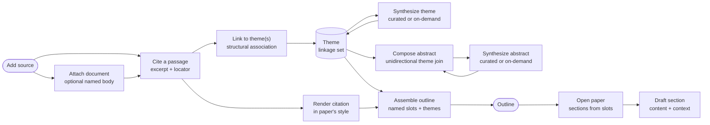

# Core Domain Distillation — Tiferet Literature Review Knowledge Base

**Status:** Draft · **Domain:** `lit-review` · **Code:** `app/` · **Branch:** `v1.x-proto`
**Companion:** `docs/domain-vision.md`

## 1. Purpose of this document

The vision statement says *what* this knowledge base is for. This document says
*how the domain is meant to work*: the vocabulary, the behaviors, the rules
those behaviors enforce, and the way the pieces relate. It is the reference a
contributor should read before writing the first domain object, and the
reference a reviewer should read before judging whether a change belongs.

**This distillation is still the conceptual reference**, even though capture,
theme synthesis, and APA rendering now exist on `v1.x-proto`. Where a claim
needs grounding, it is grounded in the Tiferet conventions this application is
built with — `DomainObject`, `DomainEvent`, `Aggregate`/`TransferObject`, and
`Service` — and, where already implemented, in `app/domain/`. Section 10 remains
the list of slices this vocabulary is meant to keep honest.

It is written to be legible to a technical-adjacent reader who has not yet read
the framework's own conventions in depth. Where a term is unavoidable, it is
defined once, in Section 3, and then used consistently.

## 2. The core domain, restated precisely

The core domain is **capturing sourced evidence and synthesizing it into
themes that can be arranged into an outline and drafted, correctly cited,
into a paper**.

A piece of reading does not become useful by being stored. An unattached
bibliographic stub is inert. An attached source document is still not a
citation — it is the work you can reopen, download under a stable name, or
compare — but meaning is made only once a specific passage is pulled out as
evidence and connected to an idea that recurs elsewhere in the literature.
That connection is where the intellectual work happens: not at the moment a
source is added, not at the moment a file is attached, and not at the moment
a passage is copied out, but at the moment a passage is told to belong to an
idea that other passages, from other works, also belong to.

The domain has exactly one shape:

> **Capture** a source → **attach** its document when the file is on hand →
> **cite** a passage from it → **link** the citation to a theme →
> **synthesize** the theme's description (curated or on demand) → **compose**
> an abstract from a selection of themes → **render** the citation in the
> paper's required style → **assemble** an outline of named slots → **open a
> paper** from that outline → **draft** each paper section.

and exactly two axes of variation:

1. **Source medium** — the kind of work being read (PDF, book, journal
   article, and whatever is added later), which determines what bibliographic
   fields are expected and what a "locator" (the passage's precise position)
   means for that medium.
2. **Citation style** — the named formatting convention (APA, MLA, Chicago, or
   another) a given paper requires, which determines how a bibliographic
   record and a locator render into an in-text citation and a reference-list
   entry.

Everything else — attaching or retrieving a source's named document, recording
a citation's excerpt and locator, linking a citation to a theme,
re-synthesizing a theme's description as its linkages grow, composing an
abstract from a selection of themes, assembling an outline, and opening a
paper whose sections can be drafted — is identical regardless of what kind of source is
being read or what style the paper eventually needs. How a locator maps into
an attached file, and which extension a download name carries, still follow
the source-medium axis. That asymmetry is the single most important fact
about this domain, and Section 8 treats it directly.

## 3. Ubiquitous language

**Source** — a work being read: a PDF, a book, or another medium added later.
Carries a bibliographic record and, when the researcher has the file, a named
source document. The document is optional; the bibliographic record is not.

**Source document** — the optional body of a source: the bytes of the work
itself, held with that source and no other. It has no identity of its own.
A generic knowledge-base document type, if used underneath a Paper, is
infrastructure — not this noun and not "the outline." It is created by
attaching a file to an existing source, not as a standalone record.

**Document name** — the API / download filename stored on the Source. When a
source document is retrieved, this is the name the file is written under — not
the original upload name on disk. If the caller does not supply one, the
Source derives a default from its bibliographic record
(`{first_author_slug}[_et_al]_{year}_{title_slug}.{ext}`), with `et_al` only
when there is more than one SourceAuthor. Deriving that name is Source
behavior, the same family as `authors_short`.

**Bibliographic record** — the structured metadata about a source (its
SourceAuthors, year, title, container title, publisher, and the other fields a
citation style needs) required to reference it correctly. Captured once, per
source, and reused by every citation and every rendering drawn from that source.

**SourceAuthor** — a value object copied onto a Source: the name as it appears
on that work, and only the name. It has no identity of its own, no publisher
id, and no life-cycle separate from the Source it belongs to. It is not created
on its own; `SourceAggregate.add_author` copies the printed name onto the
source. Persistence may rehydrate the same value object from stored display
names. Parsing a captured name into a family name and initials, and joining
those names for in-text or reference-list form, is behavior of SourceAuthor and
Source — not of a render event.

**Author** — a person who writes. This domain does not model Authors. Treating
a SourceAuthor as an Author (giving it an id, merging two names into one
person, or looking people up) is out of scope and would be a different bounded
context.

**Locator** — the precise position of a passage within a source: a page range
for a PDF or book today, and whatever position concept a future medium
requires (see Section 4).

**Citation** — an excerpt or paraphrase pulled from a source, together with its
locator and enough surrounding context to be understood on its own. The atomic
unit of evidence in this domain.

**Theme** — a strand of meaning that gathers citations from one or more
sources. A theme carries a **synthesized description**: a standing, current
statement of what its linked citations collectively say, distinct from any one
citation's wording.

**Linkage** — the structural relationship connecting a citation to a theme.
Forming a linkage is the atomic act of attaching evidence to an idea,
incrementing the theme's linkage count without destructively overwriting any
existing narrative description. A citation may hold linkages to more than one
theme.

**Synthesis** — the evaluative act of generating or revising a standing
description against a full related set. For a theme, that set is its linked
citations; for an abstract, that set is its linked themes. Can be performed
manually (curated editorial synthesis), invoked on demand, or requested at
link time via an opt-in flag. Theme synthesis and abstract synthesis are the
same *kind* of act and **different services** — they do not share one
implementation or one prompt.

**Abstract** — a standing brief of one argument, composed from a chosen set of
themes. It lives in the knowledge base without a Paper. It is not a theme of
themes, not a source's published abstract, and not a **Paper Abstract**. A
source's printed abstract, if captured later, is bibliographic data on the
Source and must not share this noun.

**AbstractTheme** — the unidirectional join from an abstract to a theme.
Forming it includes a theme in that argument and does not rewrite the
abstract's body. A theme may appear in many abstracts; the theme does not own
those abstracts.

**Citation style** — a named formatting convention (e.g. APA, MLA, Chicago)
that determines how a bibliographic record and a locator are rendered.

**Formatted reference** — a bibliographic record rendered, in a given citation
style, into the reference-list entry form for a source.

**In-text citation** — a citation's locator rendered, in a given citation
style, into the short parenthetical or footnote form used inline in prose.

**Assembly** — arranging named slots into an **Outline**, then including
themes in those slots. Assembly is a researcher or agent act: name the
outline, add slots, add or remove themes. It is **not** synthesis — there
is no outline synthesizer and no prompt that invents the order. Assembly
does not draft prose and does not create a Paper.

**Outline** — an ordered set of named slots. It is the arrangement of an
argument, not the manuscript. Opening a paper **copies** those slots into
Paper Sections and then the two diverge. The outline remains as origin
record (`Paper.outline_id`); it is not a live twin and is not kept in sync.
Re-arranging the *whole* argument means assembling a **new** outline, then
opening a **new** paper. Adding a slot, or adding or removing a theme on an
existing slot that has not yet been opened, is still the same arrangement.

**OutlineSlot** — the outline form of a section: a stable `id`, a human
`title`, and an optional list of themes. It is owned by the Outline, has no
drafted `content` or `context`, and is not a Theme. Themes may be omitted at
create and added or removed later. Nested / hierarchical slots are out of
scope for this pass.

**Paper** — the manuscript aggregate. It owns a Paper Abstract, ordered Paper
Sections, and the Paper Citations used in that manuscript. Children are
created through the paper, not as standalone records.

**Paper Abstract** — the brief owned by a Paper. It may be copied from a KB
Abstract and then edited. It is not the KB Abstract noun.

**Paper Section** — a part of a Paper: title, drafted content (human or
agent), a **context** note (why this section exists / why it was drafted this
way), and an ordered list of themes that justify it. A section may have zero
citations (methods, results). Theme membership is a join, not a blob of ids.

**Paper Citation** — a citation *used in this manuscript*, resolved to a KB
Citation / Source. Not a second evidence store.

**Publication** — a later event: venue, date, DOI. Not part of drafting. When
a paper is published, that appearance can become a Source.

**Provenance** — the unbroken path from drafted paper-section content back
through its themes and citations to sources, and from an outline slot the
same way.

## 4. What the domain reads / operates on

The domain operates on bibliographic data about a source, on citation text
the researcher (or an agent) has already extracted, and — when attached — on
the named source document that belongs to that source. It does not parse the
file. That is a deliberate boundary (Section 9): PDF text extraction, OCR,
and the mechanics of getting words out of a book are infrastructure the
domain depends on, not part of it. Asking for "the body of this source" or
"the bytes at this locator" is domain; turning those bytes into words is
infrastructure.

What is captured, per source medium:

- **PDF or book (today):** SourceAuthors (names as printed), year, title, and
  publisher-family fields, plus a page-range locator for each citation drawn
  from it. The CLI may accept those names as strings; `AddSource` copies each
  one onto the source through `SourceAggregate.add_author`.
- **Any future medium** (journal article, web page, dataset, and so on) is
  expected to supply the same two things — a bibliographic record and a
  locator convention appropriate to that medium — without changing anything
  about how citations, linkages, or themes work. This is the leverage point of
  the source-medium axis: new mediums are new *field sets and locator shapes*,
  not new domain behavior.

At render time, the domain also takes a **citation style selection** as input,
and at assembly time it takes the **target outline shape** — the sections and
paragraph slots a specific paper defines. Neither input changes what a
citation or a theme *is*; both change how existing citations and themes are
*rendered and arranged*.

## 5. The behaviors

Each behavior below is a bounded step, described as a candidate domain event in
the Tiferet sense — a unit with a clear input and output, dependencies
supplied by injection, and an `execute(**kwargs)` entry point
(`tiferet/events/settings.py`). Capture, cite, theme link/synthesize, render,
source-document attach, and abstract already exist on `v1.x-proto`. Outline
is landing in this slice. Paper does not. Naming those steps here is what
makes Section 10 concrete.

### 5.1 Capturing a source

*Register a work being read, with its bibliographic record.*

Would be modeled as a domain event (candidate name: `AddSource`) constructing a
`Source` domain object and its mutable `Aggregate` counterpart, following
Tiferet's split between read-only domain objects and the aggregates that
mutate them (`tiferet/domain/settings.py`, `tiferet/mappers/settings.py`).
Author names are copied onto that aggregate one at a time; they are not
constructed as independent objects at the event boundary. `AddSource` does not
require a file; a source may be captured as bibliography only.

**Variable** with respect to the source-medium axis: the expected bibliographic
fields and the locator convention differ by medium. **Agnostic** otherwise: a
source is a source regardless of what will later be cited from it.

### 5.2 Attaching and retrieving a source document

*Hold the work with the source, under a stable download name, and give it
back on demand.*

Candidate events: `AttachSourceDocument` and `GetSourceDocument`.
`AttachSourceDocument` takes an existing `source_id`, a path to the file being
uploaded, and an optional `document_name`. If `document_name` is omitted, the
Source derives the default from its bibliographic record. The name is stored
on the Source (`document_name`); the bytes are stored by infrastructure as an
HDF5 array under the same source group (`tiferet_h5` `create_array` /
`get_array`). Ordinary `get` / `list` stay metadata-only. `GetSourceDocument`
returns the bytes and the document name so a download is written under the API
name, not the original upload name.

Compare-against-document is the same retrieve path used by an agent: resolve
one or two sources to their bodies (and, where a locator is given, ask
infrastructure to address into that body). The domain decides *which* source
and *which* locator; it does not implement PDF libraries.

**Agnostic** in mechanism: every medium attaches, names, and retrieves the
same way. **Variable** only in the download extension and in how a locator
maps into the attached file — both follow the source-medium axis already
established at capture.

### 5.3 Citing a passage

*Pull an excerpt from a source, at a precise locator, with enough context to
stand alone.*

Candidate event: `AddCitation`. A citation always refers to exactly one source
and carries one locator plus the excerpt text.

**Agnostic**: the shape of a citation — source reference, locator, excerpt —
is uniform no matter the source medium. **Variable** only in that the locator's
internal shape (a page range, eventually something else) traces back to the
source-medium axis established when the source was captured.

### 5.4 Linking a citation to a theme

*Attach a citation to one or more themes, establishing a durable evidence relationship.*

Candidate event: `LinkCitationToTheme`. Linking is a pure structural operation:
it verifies the citation and theme exist, creates a unique `Linkage` row, and
increments the theme aggregate's `linkage_count`. By default, linking is
non-destructive and zero-cost with respect to text generation: it does not
overwrite an existing human-crafted thesis summary. When immediate synthesis
is desired, an opt-in flag (`--include-synthesis`) can trigger the synthesis
pipeline as part of the link event.

**Fully agnostic** with respect to both axes: linking is identical no matter
what medium the citation's source came from or what style the eventual paper
will use.

### 5.5 Synthesizing and updating a theme

*Generate, revise, or manually curate a theme's synthesized description.*

Candidate events: `SynthesizeTheme` (or `ResynthesizeTheme`) and `UpdateTheme`.
- `SynthesizeTheme` loads all citations currently linked to the theme, invokes the
  injected `ThemeSynthesisService.synthesize(theme, citations)`, and updates
  the theme aggregate's `synthesized_description`.
- `UpdateTheme` provides direct editorial control, updating the theme's name or
  manually written narrative synthesis via `set_attribute()`.

Decoupling synthesis from linking ensures batch ingestion is efficient, human
prose is first-class, and automated synthesis can be re-run on demand whenever
a new synthesis model or algorithm lands.

**Fully agnostic**: synthesis reads already-captured citations and produces
text independent of source medium or output citation style.

### 5.6 Composing and synthesizing an abstract

*Name an argument-level brief, include themes in it, and write or generate
its body.*

Candidate events: `AddAbstract`, `UpdateAbstract`, `LinkThemeToAbstract`,
`SynthesizeAbstract`, `GetAbstract` / `ListAbstracts`.

- `AddAbstract` creates an abstract with a name and an empty (or supplied)
  body. Themes are not required at creation.
- `LinkThemeToAbstract` is structural and unidirectional (abstract → theme):
  verify both exist, create a unique `AbstractTheme` row, increment a
  denormalized theme count on the abstract. By default it does not rewrite
  the body. An opt-in flag may trigger synthesis the same way theme-link
  does.
- `UpdateAbstract` writes name and/or body via the aggregate — editorial
  first-class, no themes required.
- `SynthesizeAbstract` loads **all** themes currently joined to the abstract
  and calls an injected `AbstractSynthesisService.synthesize(abstract,
  themes)`. That service is a sibling of `ThemeSynthesisService`, not the
  same object and not the same prompt. Swapping an agent, a naive
  concatenator, or a later LLM is a `di.yml` change.

An abstract is not assembled into an outline by this step. Assembly (5.8)
arranges named slots; opening a paper (5.9) is a later act.

**Fully agnostic** with respect to both axes: composing an abstract does not
depend on source medium or citation style. It reads theme descriptions, not
raw files or rendered references.

### 5.7 Rendering a citation in a style

*Format a source's bibliographic record and a citation's locator into a
specific citation style's in-text and reference-list form.*

Candidate event: `RenderCitation`, taking a citation and a style selection and
producing a formatted reference and an in-text citation.

**This is the step whose behavior is entirely defined by one axis.** The
rendering mechanism — take a bibliographic record and a locator, produce two
strings — is the same for every style. What differs, per style, is the
rulebook: field order, punctuation, abbreviation conventions, and how the
in-text form is shaped. Name parsing and locator display live on SourceAuthor,
Source, and Citation (`app/domain/source.py`, `app/domain/citation.py`); the
render event only resolves those objects and applies the rulebook templates.
Generic template substitution may stay beside that event until a second
subdomain needs the same helper. This is the same "one mechanism, many
rulebooks" pattern the Tiferet Dialect Compiler uses for component types
(`docs/compiler/core-domain-distillation.md` in `tiferet-takwin`, Section 5.4)
— here the rulebook varies by citation style instead of by component type.

### 5.8 Assembling an outline

*Arrange named slots, then include optional themes in those slots. Do not
draft prose.*

Candidate events: `AssembleOutline`, `AddOutlineSlot`,
`AddOutlineSlotTheme`, `RemoveOutlineSlotTheme`, `GetOutline` /
`ShowOutline` / `ListOutlines`.

- `AssembleOutline` names a new empty Outline. Re-running assemble always
  creates a **new** Outline.
- `AddOutlineSlot` appends a named grouping via `OutlineAggregate.add_slot`.
  A title is required; themes are optional at create. Every supplied theme is
  verified first; any miss writes nothing. A missing outline is
  `OUTLINE_NOT_FOUND`.
- `AddOutlineSlotTheme` / `RemoveOutlineSlotTheme` adjust themes on an
  existing slot. Both require `has_slot`; a missing slot is
  `OUTLINE_SLOT_NOT_FOUND`. Re-adding a theme already on that slot, or
  removing a theme that is not there, is idempotent.

Output is an **Outline** — named slots that may include themes and can
preview rendered citations. These events do **not** create a Paper and do
**not** write section content. An LLM may propose an order as a caller; the
domain only stores the slots that were placed. Nested slots are not in this
pass.

**Agnostic** in mechanism: arranging named slots does not depend on source
medium. Preview rendering, if offered, uses Section 5.7.

### 5.9 Opening a paper and drafting sections

*Turn an outline into a Paper, then add content and context to each section.*

Candidate events: `OpenPaperFromOutline`, `UpdatePaperSection`,
`SetPaperAbstract`, `AddPaperCitation`.

- `OpenPaperFromOutline` creates a **Paper** aggregate. Each outline slot
  becomes a **Paper Section** with the slot's themes already joined, empty
  content, and empty context. The outline is not deleted — it is origin
  history — and it is not itself a section. After this event the paper is
  the working copy. Drafting a section does **not** write back to the
  outline; changing the outline does **not** mutate an already-opened paper.
- `UpdatePaperSection` writes content and/or the context note (why this
  section exists / why it was drafted this way). Content may be human or
  agent-produced. The domain stores both; it does not own voice.
- `SetPaperAbstract` sets the Paper-owned brief, optionally copied from a KB
  Abstract.
- `AddPaperCitation` records that a KB citation is used in this manuscript.

Children are created through `PaperAggregate` (`add_section`, `set_abstract`,
`add_citation`), same lifecycle rule as `add_author`. Persistence may map a
Paper onto a generic knowledge-base document type — that mapping is
infrastructure and must not appear in the ubiquitous language.

A later **research content** domain may feed results sections that have no
citations. Do not invent that noun here. **Publication** (venue, DOI) is a
later event; when a paper is published, that appearance can become a Source.

**Agnostic** in mechanism. Style selection affects how Paper Citations render,
not what a section *is*.

## 6. How the behaviors compose

Feature workflows are declared as ordered steps rather than hard-coded call
order (`app/assets/feature.yml`). The intended composition is:

- **capture-source** — register a source and its bibliographic record.
- **attach-source-document** — optionally hold the work with the source under
  a document name (may happen at capture or later).
- **cite-passage** — pull a citation from an already-captured source.
- **link-citation** — connect a citation to one or more themes (pure structural linkage).
- **synthesize-theme** — synthesize or curate a theme's description across its full linkage set (on demand or manual).
- **compose-abstract** — name an argument brief and join themes into it
  (structural); write or synthesize the body on demand.
- **render-citation** — format a citation in a requested style, for reuse
  wherever that citation appears.
- **assemble-outline** — name an outline, add named slots, and add or remove
  themes on those slots (no prose, no synthesizer).
- **open-paper** — create a Paper from an outline; draft each section's
  content and context.

Capture, attach, and cite form the "reading loop." Theme link/synthesize is
the idea loop. Abstract compose/synthesize is the argument loop. Outline is
arrangement. Paper is the drafting loop.

## 7. Relationships / cross-boundary rules

A source has many citations; a citation belongs to exactly one source but may
hold linkages to many themes; a theme is defined by the full set of citations
currently linked to it. None of these relationships are optional metadata —
each is load-bearing for a specific later behavior:

- **Source → SourceAuthor** is what makes a source citable without inventing
  an Author entity: the names used in rendering are copies on the Source, not
  references to people. The copy is created by `add_author`; the transfer
  object may rehydrate the same value object from storage.
- **Source → Source document** is what makes reopen, download, and agent
  comparison possible: the body lives with the source, addressed by the
  document name on that source. A citation never stores the file.
- **Citation → Source** is what makes rendering (5.7) possible at all: a
  citation carries only a locator, not a bibliographic record, so rendering
  always resolves through the source it names.
- **Citation → Theme** (via linkage) is what makes theme synthesis (5.5)
  possible: a theme's description is a function of *all* its linkages, not the
  newest one, so revising a theme requires reading its full linkage set.
- **Abstract → Theme** (via AbstractTheme) is what makes abstract synthesis
  (5.6) possible: the brief is a function of the joined themes' current
  descriptions, not of citations directly and not of a blob of ids on the
  abstract. The join is unidirectional; a theme may appear in many abstracts.
- **Theme → Outline** (via named `OutlineSlot` / `AddOutlineSlotTheme`) is
  arrangement only: a slot is a titled grouping that may include themes so a
  later Paper Section can be born with that membership. The slot and its
  theme joins are owned by the outline, not a second CRUD vertical.
- **Paper → Outline** is optional origin (`outline_id`), not a bidirectional
  sync. After open they are isomorphic only at that instant.
- **Paper → Paper Section / Paper Abstract / Paper Citation** is ownership:
  children have no life-cycle off the Paper aggregate.
- **Paper Section → Theme** (via join) is what makes a drafted section
  traceable: content + context walk back through themes to citations and
  sources. A section may have zero citations.
- **Paper Abstract** may copy a KB Abstract; it does not replace it.

This is why opening a paper (5.9) cannot be "the outline, plus prose in the
same row." Arrangement and manuscript are different acts. Judging a section
correctly requires the theme list and the context note, not only the drafted
text — the same shape of requirement the Tiferet Dialect Compiler names for
relationship checking (`docs/compiler/core-domain-distillation.md` in
`tiferet-takwin`, Section 7).

## 8. The agnostic core and the variable edge

Stated plainly, so that implementation work can be scoped against it:

**Agnostic — build once, never per axis:**
- Recording a citation's excerpt and locator reference.
- Attaching, naming, and retrieving a source document (one optional body per
  source).
- Forming a linkage between a citation and a theme.
- Forming a unidirectional AbstractTheme join.
- The mechanism of theme synthesis and of abstract synthesis (each a
  description given a related set). The *services* stay separate.
- Assembling named slots into an outline (title plus optional themes; add or
  remove themes on an existing slot; not a synthesis service).
- Opening a Paper from an outline and drafting section content + context.
- Provenance from paper section (or outline slot) back through themes to source.

**Variable — one definition per axis:**
- **Per source medium:** the expected bibliographic fields, the shape of a
  locator, the download-name extension, and how a locator maps into an
  attached file.
- **Per citation style:** the rulebook a bibliographic record and locator are
  rendered through to produce an in-text citation and a reference-list entry.

**Anticipated entanglement — risks to design against, not yet incurred:**
Because no code exists, there is no line-referenced inventory to give here.
The honest equivalent, for a forward-looking distillation, is to name where
entanglement is *likely* to appear if the two axes are not deliberately
separated from day one:

- Treating "PDF" as the only source medium in the citation's locator shape,
  rather than letting locator shape vary by source medium from the start,
  would silently couple citation recording to one medium.
- Treating a SourceAuthor as an Author — giving the copied name an identity,
  a publisher id, or a life-cycle of its own — would pull author management
  into a domain that only needs enough name to cite a work. Constructing a
  SourceAuthor outside the source aggregate is the same entanglement: the
  value object would appear to exist on its own.
- Putting name parsing or locator display on a render event, rather than on
  SourceAuthor / Source / Citation, would hide domain behavior in the wrong
  layer and make a second style look like new Python instead of new rulebook
  data.
- Hard-coding one citation style's punctuation or field order into the
  bibliographic record itself, rather than keeping the record style-neutral
  and rendering per style on demand, would make adding a second style a
  rewrite instead of an addition.
- Letting assembly read a theme's synthesized description without also
  resolving live citation renderings would let an outline drift out of sync
  with its own citation style if that selection changes after themes are
  already assembled.
- Making "has a file" a second Source type, or putting PDF libraries inside
  attach/retrieve events, would couple the reading loop to one medium and one
  parser.
- Putting raw bytes on the Source domain object, or loading them on ordinary
  `get` / `list`, would make every bibliographic read pay for the file.
- Treating a source document, an Outline, or a Paper as a user-facing
  `tiferet-kb` Document would put infrastructure in the ubiquitous language.
- Treating Outline as Paper (or assembling prose into the outline) would
  collapse arrangement and drafting.
- Routing outline order through a synthesis service (or requiring an LLM to
  assemble) would hide a user arrangement act behind a prompt and make a
  later reorder look like re-generation.
- Keeping an opened Paper and its origin Outline in live sync would force
  two isomorphic structures to stay twins; they are not. Open is a fork.
- Creating Paper Section / Paper Abstract / Paper Citation outside the Paper
  aggregate would break the same lifecycle rule as a standalone SourceAuthor.
- Treating an Abstract as a Theme of themes, or routing both through one
  `ThemeSynthesisService` / one prompt, would collapse two jobs into one
  implementation and make a later abstract LLM a branch instead of a swap.
- Using "abstract" for a source's printed summary would collide with this
  argument-level noun.
- Adding tags beside themes would introduce a second, weaker classification
  the vision already rejected.

Naming these now is what the first implementation slice (Section 10) should
be built to avoid.

## 9. Boundaries

**Inside the domain:** capturing sources and their bibliographic records
(including SourceAuthor names copied from the work), attaching and naming a
source document, retrieving that named body, recording citations with their
locators, forming and refining linkages between citations and themes,
composing an abstract from a selection of themes, rendering citations in a
requested style, assembling an outline of named slots, and opening a Paper
whose sections hold drafted content, context, and theme membership.

**Outside the domain:**
- Extracting text from a PDF, transcribing a book, or running OCR — supplied
  by infrastructure utilities the domain depends on (in Tiferet terms, a
  `FileService`-style component, `tiferet/interfaces/settings.py`), not
  authored by it.
- Inventing the paper's voice — the domain stores section content and a
  context note; it does not own narrative phrasing. Publication (venue, DOI)
  is a later event.
- Deciding *which* citation style a given paper requires — that is supplied to
  the domain as a selection, the same way a target outline shape is supplied,
  not decided by it.
- Managing Authors as people — identity, affiliation, name authority, merging
  two SourceAuthors into one person. A SourceAuthor is a copied name, not a
  person.
- Generic knowledge-base document/section types, HDF5 array I/O, and the
  shared store — infrastructure. A Paper may persist *through* those types;
  they are not ubiquitous-language nouns.

## 10. Where this leads

Items 1–4 below already exist on `v1.x-proto`. What remains:

1. **Domain objects for the four core nouns.** Landed: `Source`, `Citation`,
   `Theme`, and `Linkage`, with the source-medium axis as field variation on
   `Source`, not separate types.
2. **The reading-loop events.** Landed: `AddSource`, `AddCitation`, and
   `LinkCitationToTheme` (structural by default after RFP-3.1).
3. **Citation style as a declared rulebook.** Landed: APA as data the render
   event reads, not a branch inside it.
4. **One citation style as proof.** Landed: APA through `RenderCitation`.
5. **Source document attachment and retrieve.** Landed (`v1.0.0a7`).
6. **Abstract composition.** Landed (`v1.0.0a8`).
7. **Outline assembly.** Arrangement only (issue #6). Named slots with
   optional themes; incremental add/remove of themes on a slot. Does not
   create a Paper. No outline synthesizer. Nested slots later.
8. **Paper.** Manuscript aggregate from an outline; section content + context.
   Later than outline. Publication is later still.

Each remaining item is a candidate for its own RFP. Together they are the
difference between a set of ideas about how a literature review knowledge
base should work and the knowledge base the vision statement describes.
